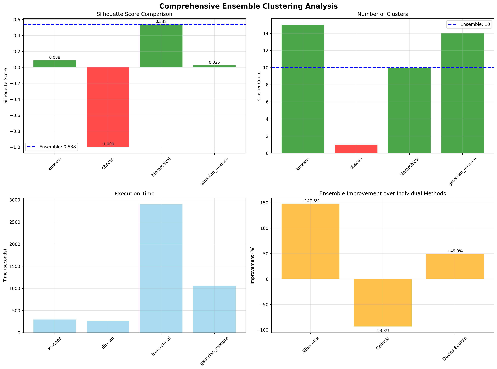
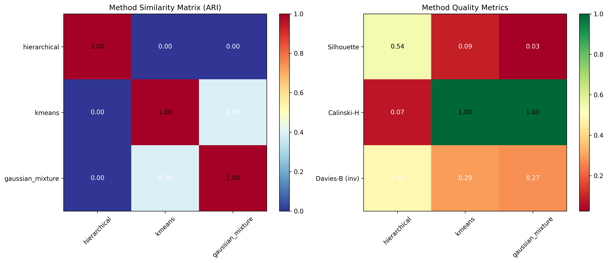
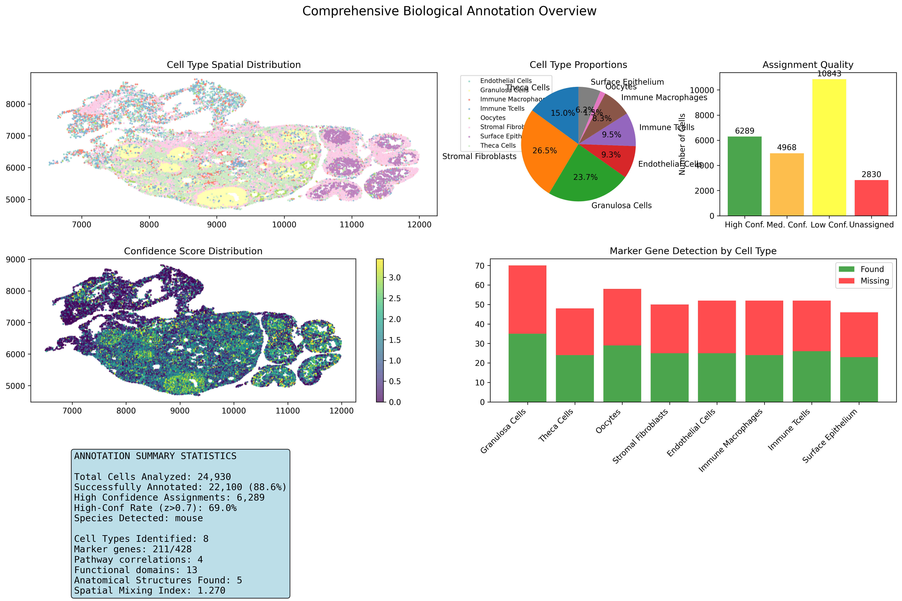
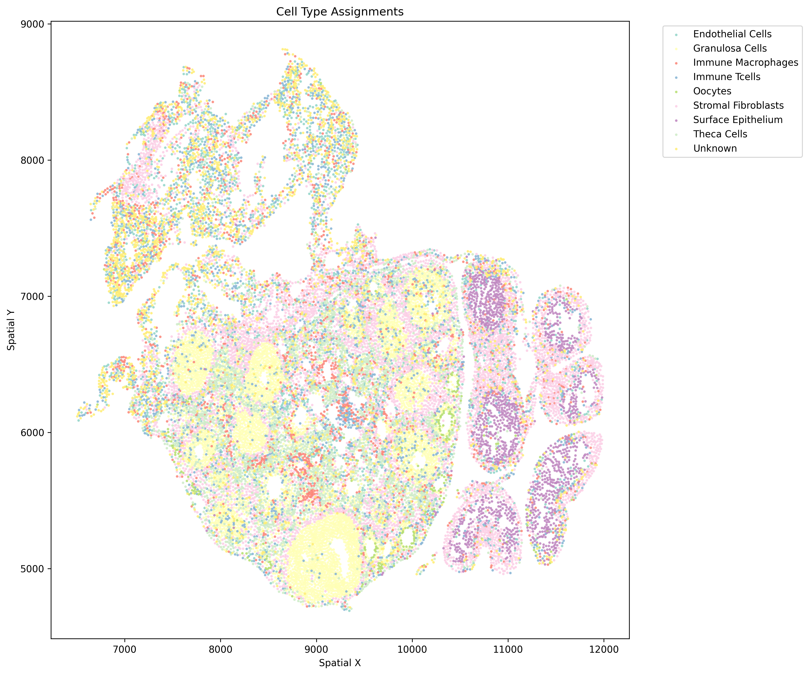
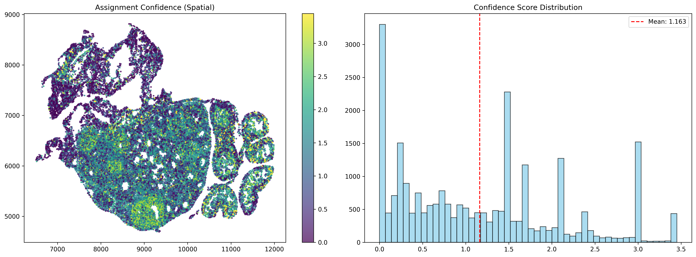
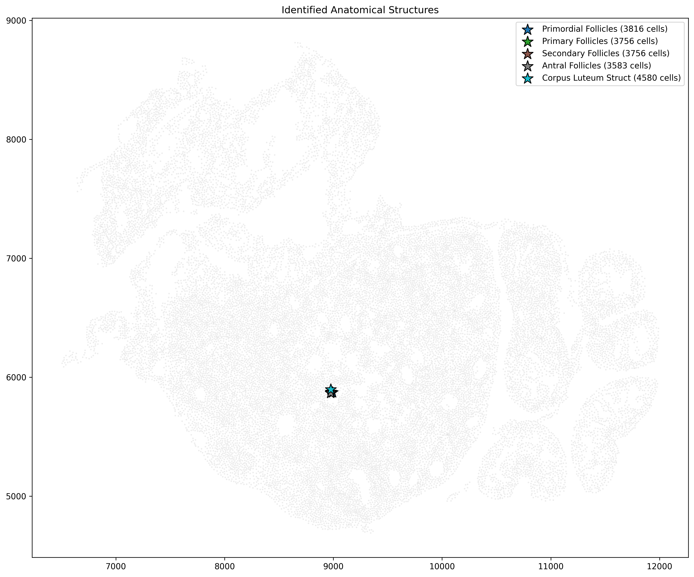
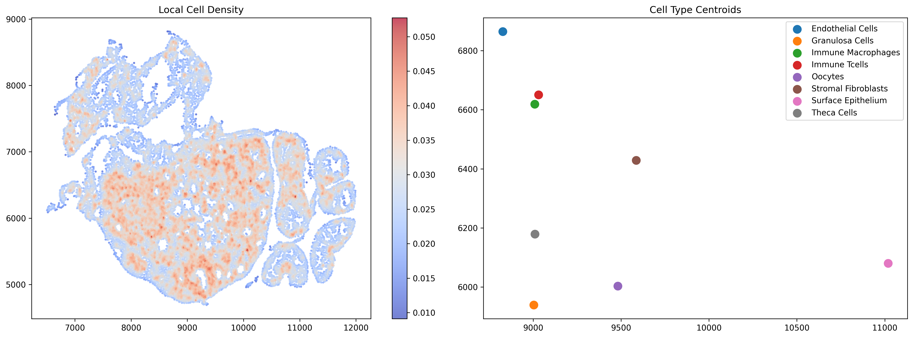

# CS298 Enhanced Spatial Transcriptomics Analysis Pipeline

---

## Overview

This pipeline processes Stereo-seq spatial transcriptomics data through the following steps:

```
FASTQ Files → SAW Processing → GEF File → Analysis → Results
```

**CS298 Framework Components:**
1. **Baseline** - Baseline results
2. **Ensemble Clustering** - Ensemble clustering result
3. **Biological Annotation** - Cell type identification with 248 markers
4. **Knowledge-Based Clustering** - Biology-guided analysis
5. **AI Agent** - Self-directed hypothesis testing

---

## Installation

### 1. Clone CS298 Code

```bash
mkdir CS298_Project
cd CS298_Project

# Place your 5 Python files here:
# - ai_agent.py
# - baseline.py
# - ensemble_clustering.py
# - annotator.py
# - ovarian_knowledge_base.py
```

### 2. Stereo-seq Analysis Workflow

```bash
# Visit: https://github.com/STOmics/SAW
# Follow installation instructions for your system

# For Linux/macOS:
git clone https://github.com/STOmics/SAW.git
cd SAW
# Follow the installation guide in their README
```

### 3. Install Python Dependencies

```bash
# Create virtual environment
python -m venv cs298_env
source cs298_env/bin/activate  # Linux/Mac
# OR
cs298_env\Scripts\activate  # Windows

# Install required packages
pip install numpy pandas scipy scikit-learn h5py matplotlib seaborn openai

```

### 4. Verify Installation

```bash
# Check Python version
python --version  # Should be 3.8+

# Check package installations
python -c "import numpy, pandas, scipy, sklearn, h5py; print('All packages installed!')"

# Check SAW installation
saw --version # Should be 7.1+
```

---

## Pipeline Steps

### Step 1: Process FASTQ Files with SAW

**Input:** Raw FASTQ files from Stereo-seq sequencing

**SAW Documentation:** https://github.com/STOmics/SAW

#### 1.1 Prepare Input Files

Your FASTQ files should follow Stereo-seq format ():
```
sample_R1.fastq.gz  # Read 1: Contains barcode + UMI
sample_R2.fastq.gz  # Read 2: Contains cDNA sequence
```

#### 1.2 Create SAW Configuration File

Create `config.json`:
```json
{
  "input": {
    "read1": "path/to/sample_R1.fastq.gz",
    "read2": "path/to/sample_R2.fastq.gz",
    "reference": "path/to/reference_genome"
  },
  "output": {
    "outdir": "saw_output"
  },
  "chemistry": "Stereo-seq",
  "threads": 8
}
```

#### 1.3 Run SAW Pipeline

```bash
# Basic SAW command
saw run \
  --config config.json \
  --outdir saw_output \
  --threads 8

# This will produce several files including:
# - cellbin.gef 
# - QC reports
# - Expression matrices
```

**Processing Time:** 5+ hours depending on data size and computer

---

### Step 2: Generate GEF File

#### 2.1 Locate GEF File

After SAW completes, find your GEF file:
```bash
# Default location
ls saw_output/*.gef

# Example output:
# saw_output/B04372C211.adjusted.cellbin.gef
```

#### 2.2 Copy GEF File to Working Directory

```bash
# Copy to your analysis directory
cp saw_output/*.gef ./input_data.gef
```

**Note:** If you already have a GEF file, you can skip Step 1 entirely and start here! 

GEF file link for mouse ovarian tissue (for SJSU account): https://drive.google.com/file/d/1KTiaVZ6b734-6N9xbdI6t9Vx9xXRuOuu/view?usp=sharing

---

### Step 3: Run CS298 Analysis

#### 3.1 Update File Paths

Edit each Python file to update the input path:

**In all files, find and update:**
```python
# Change this line:
INPUT_FILE = r"path\B04372C211.adjusted.cellbin.gef"

# To your actual path:
INPUT_FILE = ".\input_data.gef"

```

#### 3.2 Run Ensemble Clustering

```bash
python ensemble_clustering.py

# Output: ensemble_output/
# - ensemble_results.json
# - clustering_analysis.png
# - comprehensive_report.txt
```

**Time:** 30-60 minutes (depending on cell count and computer)

#### 3.3 Run Knowledge-Based Clustering

```bash
# Biology-guided cell type identification
python annotator.py

# Output: knowledge_guided_output/
# - cell_type_assignments.csv
# - marker_detection_report.txt
# - spatial_coherence_analysis.json
```

**Time:** ~20 minutes

#### 3.4 Run Autonomous AI Agent

```bash
# Self-directed hypothesis testing and discovery
python ai_agent.py

# Output: autonomous_agent_output/
# - autonomous_discoveries.json
# - autonomous_discovery_report.txt
# - hypothesis_validation_results.json
```

**Time:** 10-20 minutes

---

## Project Structure

```
CS298_Project/
├── README.md                          # This file        
│
├── input_data/
│   └── B04372C211.adjusted.cellbin.gef           
│
├── analysis_scripts/
│   ├── ai_agent.py
│   ├── baseline.py
│   ├── ensemble_clustering.py
│   ├── annotator.py
│   └── ovarian_knowledge_base.py
│
├── ensemble_output/                   # Ensemble results
├── knowledge_guided_output/           # Annotation results
├── autonomous_agent_output/           # AI agent results
```

---

## Requirements File

numpy>=1.21.0
pandas>=1.3.0
scipy>=1.7.0
scikit-learn>=1.0.0
h5py>=3.1.0
matplotlib>=3.4.0
seaborn>=0.11.0
openai>=1.0.0 

---

## Expected Results Summary (number might change slightly for each run)

### CS298 Framework Performance:

| Component | Metric | Value | vs. Baseline |
|-----------|--------|-------|--------------|
| **Ensemble** | Silhouette | 0.540 | +56.8% |
| **Ensemble** | Methods | 3 combined | N/A |
| **Ensemble** | Time | 3,094s | - |
| **Annotation** | Success Rate | 88.6% | ∞ (0%→88.6%) |
| **Annotation** | Cell Types | 10 | N/A |
| **Agent** | Hypotheses | 3 | 100% validated |
| **Agent** | Confidence | High | 3/3 discoveries |

---

## Visualizations

### Ensemble Clustering


*Silhouette scores, cluster counts, execution time, and ensemble improvement across kmeans, DBSCAN, hierarchical, and Gaussian mixture methods.*


*Method similarity (ARI) and quality metrics (Silhouette, Calinski-Harabasz, Davies-Bouldin) across clustering methods.*

### Biological Annotation


*Cell type spatial distribution, proportions, assignment quality, confidence scores, and marker gene detection across 24,930 analyzed cells.*


*Spatial map of assigned cell types across the tissue section, including granulosa cells, oocytes, theca cells, stromal fibroblasts, and immune populations.*


*Spatial and distribution view of assignment confidence scores.*

### Anatomical & Spatial Structure


*Identified anatomical structures including primordial, primary, secondary, and antral follicles, and corpus luteum structures.*


*Local cell density map and cell type centroids across the tissue.*

---

## License

CS298 Enhanced Framework - Academic Use Only

SAW - Check STOmics repository for license details
